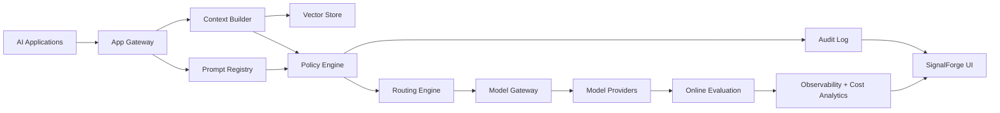

# Architecture

## Core components
- App Gateway
- Prompt Registry
- Context Builder
- Policy Engine
- Routing Engine
- Model Gateway
- Eval Harness
- Observability Layer
- Audit Log

## Guardrails
- PII redaction before model calls
- Prompt injection checks
- Sensitive topic detection
- Human review for high-risk workflows
- Model promotion gates
- Canary releases for model changes
- Rollback support
